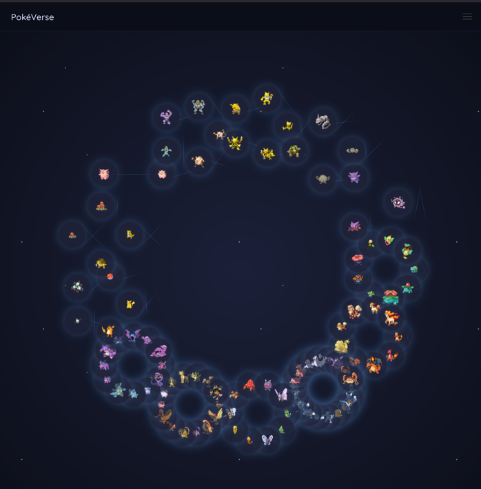

# GraphQLMons

Silly website about Pokemons using GraphQL in backend.

## Technologies Used
- **Frontend**:
  - HTML5, CSS3 (Bulma CSS Framework)
  - JavaScript (ES6)
- **Backend**:
  - FastAPI (Python)
  - GraphQL
- **Others**:
  - Font Awesome for icons
  - Google Fonts for typography

## Installation

### Prerequisites
- **Node.js** and **npm**
- **Python 3.10+**
- **FastAPI** dependencies

## Contributing
Contributions are welcome! Please fork the repository, create a feature branch, commit your changes, and open a pull request.

## License
Distributed under the MIT License. See `LICENSE` for more information.
